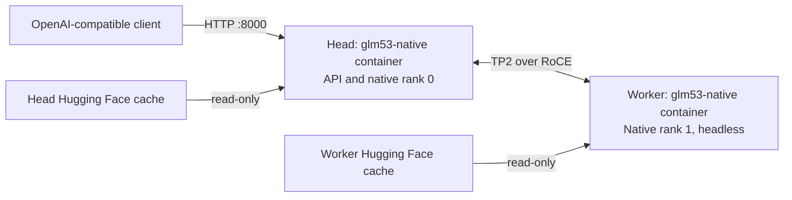

# Deployment and runtime guide

Run GLM-5.3-Flash across two NVIDIA GB10 systems with **one model container per node**, native vLLM multiprocessing, and an OpenAI-compatible API on **port 8000**. The deployment targets Linux ARM64 systems such as NVIDIA DGX Spark and ASUS GX10, connected over RoCE. Roles, addresses, interface discovery and filesystem paths are configurable; the recipe does not depend on a particular hardware vendor or hostname.

This deployment is derived from **[Kindling AI's GLM-5.3-Flash recipe](https://github.com/kindlingai/glm-5.3-flash-gx10/tree/c748079d45e6e070b2acb108a91edfe52f4a7747)**. It retains that recipe's GB10 kernels, DFlash2 speculation, RecoverSSM, adaptive scheduling and optimized weight snapshots, then replaces its Mentat orchestration with fixed native ranks. A local display-memory allocation layer backs part of the KV cache with memory reserved by the GB10 firmware for a display.

The active profile provides **six request slots**, a **1,047,552-token context limit**, **8 GiB logical KV per GPU**, and **image input**. Single-image input and six concurrent short requests have passed validation. An actual million-token request remains unqualified; see [validation and limits](#validation-and-limits).

## Contents

- [Serving profile](#serving-profile)
- [Choose C4 or C6](#choose-c4-or-c6)
- [Architecture](#architecture)
- [Source stack and local adaptations](#source-stack-and-local-adaptations)
- [KV capacity and headless display memory](#kv-capacity-and-headless-display-memory)
- [Deployment](#deployment)
- [Operating the cluster](#operating-the-cluster)
- [API examples](#api-examples)
- [Validation and limits](#validation-and-limits)
- [Image rebuild and source maintenance](#image-rebuild-and-source-maintenance)
- [Troubleshooting](#troubleshooting)
- [Repository layout](#repository-layout)
- [Credits and licenses](#credits-and-licenses)

## Serving profile

| Setting | Current value |
|---|---|
| Hardware | 2 nodes × 1 NVIDIA GB10 GPU; Linux ARM64 / SM121 |
| Target checkpoint | [`nvidia/GLM-5.3-Flash-NVFP4`](https://huggingface.co/nvidia/GLM-5.3-Flash-NVFP4) |
| Target revision | `da920bb0b9f4a06727223a349e55468e38352348` |
| Draft checkpoint | [`incoai/GLM-5.3-Flash-DFlash2`](https://huggingface.co/incoai/GLM-5.3-Flash-DFlash2) |
| Draft revision | `bf582e4eacc1810f76656d1811693ff6c6737d2a` |
| Docker Hub image tag | `technigmaai/glm-5.3-flash-gb10-tp2-native:c748079-displaykv1-arm64-cu130` |
| Published registry digest | `sha256:46afd8bba26106aa7ea6e00f6fd4bd3ba3d0c7c49e86af85f269eb2c88c71fa5` |
| Docker image ID | `sha256:46afd8bba26106aa7ea6e00f6fd4bd3ba3d0c7c49e86af85f269eb2c88c71fa5` |
| vLLM | `0.30.1rc1.dev193+gddd6fbca1` |
| PyTorch / CUDA runtime | `2.13.0+cu130` / `13.0` |
| FlashInfer | `0.7.0` |
| Parallelism | TP2; native `mp` executor; two nodes; ranks 0 and 1 |
| Maximum context | **1,047,552 tokens**, including prompt and output |
| Maximum running sequences | **6** |
| Maximum batched tokens | **6,144** |
| Fixed logical KV allocation | **8,589,934,592 bytes / 8 GiB per GPU** |
| KV dtype / block size | `fp8_e4m3` / 2,304 tokens |
| Reported KV capacity | **1,352,535 equivalent tokens** at the current 8 GiB / C6 boot |
| Display-backed portion | **1,879,048,192 bytes / 1,792 MiB per node** |
| GPU utilization / Torch memory fraction | `0.88` / `0.92`; allocator adjusts the worker budget |
| Prefix caching | Enabled |
| Speculation | DFlash2; adaptive draft width; nominal maximum 7 speculative tokens |
| Recurrent state handling | RecoverSSM enabled; separate drafter KV pool |
| MoE backend | `flashinfer_cutlass` with vendored GB10 optimizations |
| Multimodal admission | Up to **32 images per request**; video disabled |
| Multimodal processor cache | **1 GiB** |
| Tool / reasoning parsers | `glm47` / `glm45` |
| Chat template | `/usr/local/share/glm53-chat-template.jinja` in the image |
| API | Head node, `0.0.0.0:8000`; base path `/v1` |
| Recovery policy | Manual cluster operations; Compose `restart: "no"` |

The active site moved from 9 GiB to **8 GiB per GPU** on 2026-10-04,
retaining 6,144 batched tokens and six slots. The portable `.env.example` and
optional generator also default to 8 GiB, with C4 for a conservative first boot.
The earlier 9 GiB / C6 uncached boot completed, but peak swap use reached
13.19 GiB on the head and 11.40 GiB on the worker. We have not observed OOM
locally during the recorded 9 GiB checks or image publication. That observation
does not establish safety for every workload; OOM under heavier long-context,
concurrency or image loads remains possible.

**9 GiB is retained as an optional profile**, not the default. See the profile
settings below and the separately attributed [external feedback](EXTERNAL_FEEDBACK.md).

The ARM64 runtime image is published on [Docker Hub](https://hub.docker.com/r/technigmaai/glm-5.3-flash-gb10-tp2-native). The registry digest above identifies the published artifact; the local Docker image ID is recorded separately. The native entrypoint and runtime overlays come from this repository through Compose bind mounts, so use the deployment instructions below after pulling the image.

### Choose C4 or C6

Both C4 and C6 were checked at 9 GiB previously. The current 8 GiB / C6
profile passed the restart and basic checks on 2026-10-04 and was revalidated
from the reorganized deployment folder on 2026-10-07.
`C4` and `C6` mean the maximum running sequence slots (`MAX_NUM_SEQS`); the
batch token budget is shared across scheduled requests.

| Option | `MAX_NUM_BATCHED_TOKENS` | `MAX_NUM_SEQS` | Default KV per GPU | Status |
|---|---:|---:|---:|---|
| **4,096 / C4** | `4096` | `4` | 8 GiB | Conservative fresh-install profile |
| **6,144 / C6** | `6144` | `6` | 8 GiB | Current deployment profile |

Both options retain TP2, port **8000**, the **1,047,552-token context limit**,
image input, the display-memory patch and the same model aliases. Neither
option has completed a million-token workload test. Six slots do not guarantee
that six large prefills run at once: requests can queue under the token budget.

Choose **one** option and edit these values in each node's existing `.env`.
Keep host-specific addresses, paths and ranks as configured.

**4,096 tokens / C4:**

```dotenv
MAX_NUM_BATCHED_TOKENS=4096
MAX_NUM_SEQS=4
KV_CACHE_MEMORY=8589934592
```

**6,144 tokens / C6:**

```dotenv
MAX_NUM_BATCHED_TOKENS=6144
MAX_NUM_SEQS=6
KV_CACHE_MEMORY=8589934592
```

For either C4 or C6, the optional 9 GiB setting is:

```dotenv
KV_CACHE_MEMORY=9663676416
```

Its previous recorded capacities were 1,533,757 tokens at C4 and 1,524,917 at
C6. These are historical 9 GiB measurements, not the current 8 GiB capacity.
No local OOM was observed in those checks, but a different tester reported
long-context engine failures at 9 GiB. Review workload memory before selecting
this optional pool.

After saving the same profile on **both nodes**, run from the head deployment
folder during a planned interruption:

```bash
./check.sh
./restart.sh --approved
# Wait for head API readiness and the startup self-test to pass, then:
./verify.sh
```

Changing `MAX_NUM_BATCHED_TOKENS` changes the optimized snapshot key because
scratch-buffer shapes differ. The launcher reuses only complete exact-key
snapshots; if one is missing, it loads the original checkpoint and creates a
new snapshot in the native runtime cache. First loads use more memory and swap
and take longer. Both batch sizes now have matching snapshots on this site.
The Hugging Face model directories remain in their default locations.

For a **fresh deployment**, `.env.example` starts at **4,096 / C4 with 8 GiB KV**
(`KV_CACHE_MEMORY=8589934592`). Validate the initial boot before increasing
concurrency or trying 9 GiB. The earlier uncached 9 GiB C6 load used substantial
swap. See [validation and limits](#validation-and-limits) for the
recorded checks and limitations.

### Model names

The reusable configuration defaults to `glm53` and `nvidia/GLM-5.3-Flash-NVFP4`. This site's `MODEL_ALIASES` also preserves the existing client names:

```text
glm53
gx10
local-inference-lab/GLM-5.3-Flash-NVFP4-Spark
nvidia/GLM-5.3-Flash-NVFP4
```

All four names route to the **same NVIDIA checkpoint**. The Spark name is a compatibility alias, not a second loaded checkpoint. The `gx10` alias is a client setting, not hardware detection. Node addresses and cache paths belong in each node's private `.env`.

## Architecture



`compose.yaml` defines one service and is identical on both nodes. Each node has its own `.env`: `ROLE=head`, `NODE_RANK=0` on the head; `ROLE=worker`, `NODE_RANK=1` on the worker. Both use `--distributed-executor-backend mp --nnodes 2` and the same master address and port. The worker runs vLLM with `--headless`; only the head exposes the client API.

Native serving needs no Mentat daemon, Mentat router or Ray container. The base image still contains upstream Mentat artifacts, but this entrypoint does not launch them. The status helper runs inside the model container, so it adds no container.

| Port | Purpose |
|---|---|
| `8000` | Client API on the head |
| `8082` | In-container startup/status helper on each node |
| `29553` | Native vLLM master/rank coordination |
| `29511` | Startup fabric diagnostic |

Host networking and GPU/device access are configured in Compose. Both nodes need working RDMA connectivity and access to `/dev/infiniband` and `/dev/dri/card0`. The default preflight expects two fabric links, MTU 9000, and a matching IPv4 RoCE v2 GID on each link. The launcher discovers interface names from `FABRIC_SUBNETS`.

## Source stack and local adaptations

| Component | Source / pin | Role |
|---|---|---|
| Kindling recipe | [`c748079d45e6e070b2acb108a91edfe52f4a7747`](https://github.com/kindlingai/glm-5.3-flash-gx10/tree/c748079d45e6e070b2acb108a91edfe52f4a7747) | Image recipe, entrypoint foundation, experimental overlays and smoke tests |
| vLLM nightly | [`ddd6fbca148a867aad1fcab7ec72f582b9977db4`](https://github.com/vllm-project/vllm/tree/ddd6fbca148a867aad1fcab7ec72f582b9977db4) | GLM5next serving engine and native distributed runtime |
| FlashKDA | `17a037d98da546deb4591e967cf961a43c034d8b`, pinned by Kindling's image recipe | Updated recurrent-state kernel |
| Target and drafter | Exact Hugging Face revisions in the profile table | Immutable model inputs |
| Display allocator origin | [`coolbho3k/DeepSeek-v4.1-Flash-2x-DGX-Spark`](https://github.com/coolbho3k/DeepSeek-v4.1-Flash-2x-DGX-Spark), commit `878e0eecd893fadc69ad2d58b2df0fabb0fae2ee` | Display-reserved memory technique; local GLM adaptation |
| Previous GLM deployment | [`technigmaai/glm-5.3-flash-nvfp4-2x-dgx-sparks`](https://github.com/technigmaai/glm-5.3-flash-nvfp4-2x-dgx-sparks) | Earlier deployment and display-KV integration reference |

The vendored `files/overlays/` overlays provide adaptive-k scheduling, draft truncation, ARX/ARXBig collectives, sequence-parallel prefill, Triton sparse MLA, MegaMoE decode/prefill kernels, dense FP8/NVFP4 transforms, recurrent-state fixes and processed-weight snapshots. Their source is independent of the old deployment directory. The pinned [upstream experimental documentation](https://github.com/kindlingai/glm-5.3-flash-gx10/blob/c748079d45e6e070b2acb108a91edfe52f4a7747/experimental/README.md) explains the individual optimizations.

Local adaptations cover fixed native ranks, role-based configuration, direct API serving, read-only model mounts, independent caches/logs, display-backed KV allocation, and exact-key snapshot reuse. The snapshot selector prefers a complete native snapshot, then an exact matching complete read-only seed; newly created snapshots go to the native cache.

The [goshi OOM-hardening comparison](https://github.com/kindlingai/glm-5.3-flash-gx10/compare/main...goshi:glm-5.3-flash-gx10:spark3-oom-hardening) was reviewed as a possible future source of changes. It is **not part of this deployment**, and it is not the source of the display-memory patch.

## KV capacity and headless display memory

`KV_CACHE_MEMORY=8589934592` fixes the current site's logical KV allocation at **8 GiB per GPU**. GPU utilization is a separate memory-budget setting; it does not enlarge this fixed pool.

The local allocator uses 1,792 MiB of display-reserved memory per node within that 8 GiB pool. Roughly 6.25 GiB is therefore backed by ordinary unified memory, subject to the allocator's alignment. The display reservation is **not an extra 1.75 GiB added on top of the configured 8 GiB**. The worker overlay also accounts for registered ordinary memory when adjusting the Torch allocation budget.

The current 8 GiB / C6 boot reported **1,352,535 equivalent KV tokens**, approximately **1.29×** maximum context. The earlier 9 GiB / C6 boot reported 1,524,917 tokens (approximately 1.46× maximum context). This is a shared cache-capacity estimate under this profile, not a guaranteed prompt length or a private allowance for every request. Six request slots do not provide six simultaneous million-token contexts. Image processing, recurrent states, speculation and active requests also affect memory availability.

Both nodes must remain headless. The display manager is inactive on the current cluster. Host preparation, when needed on a new system, is an explicit operator action:

```bash
sudo systemctl set-default multi-user.target
sudo systemctl isolate multi-user.target
```

This ends desktop sessions. The native launcher checks the host state; it does not change the boot target, install a kernel, or modify an initramfs. The allocator implementation, compiled ARM64 helper, integration and original license are in [files/display-kv/](../files/display-kv/), with provenance in [ORIGIN.md](../files/display-kv/ORIGIN.md).

## Deployment

These instructions are for a **fresh two-node deployment**. An existing installation does not need its `.env` recreated. The default setup is to copy and edit `.env.example`; **`scripts/configure.py` is optional**.

### 1. Prepare the hosts

Use two compatible GB10 Linux ARM64 nodes with Docker Engine, Docker Compose v2, NVIDIA Container Toolkit, usable matching GPU drivers and working RoCE. Install Python 3, Bash, Git, SSH, `flock`, `ip`, `nvidia-smi`, `curl` and `jq` on the hosts, and the Hugging Face CLI for downloads. Install `rsync` on both hosts if you use `sync-repo.sh`. An optional upstream image build also needs access to its source submodules.

Make both nodes headless as described under [headless display memory](#kv-capacity-and-headless-display-memory), and verify [DRM modesetting](#drm-modesetting) on both nodes. Review [host OOM daemons](#host-oom-daemons) before an initial checkpoint load. Configure two RoCE fabric links with static IPv4 addresses, MTU 9000 and valid RoCE v2 GIDs. Configure passwordless SSH from the head to the worker. Leave both GPUs idle before the first start.

The example network throughout this guide is:

| Purpose | Head | Worker |
|---|---|---|
| LAN / native node identity | `10.10.0.1` | `10.10.0.2` |
| First RoCE fabric | `10.20.0.1` | `10.20.0.2` |
| Second RoCE fabric | `10.21.0.1` | `10.21.0.2` |

Replace those example addresses with your actual network. Both nodes must reach the head's master port and communicate across both fabric networks. Allow client access to the head's port 8000.

### 2. Obtain this deployment on both nodes

Clone this **native deployment repository**, independently on each node:

```bash
REPO_URL='https://github.com/technigmaai/glm-5.3-flash-gb10-tp2-native.git'
mkdir -p "$HOME/Development/ai-tools"
cd "$HOME/Development/ai-tools"
git clone "$REPO_URL" glm-5.3-flash-gb10-tp2-native
cd glm-5.3-flash-gb10-tp2-native
```

This repository contains the native launcher, portable configuration and vendored runtime overlays. Its upstream source is Kindling AI; the build instructions below use the pinned Kindling checkout to reconstruct the base image.

For an offline installation, copy the deployment source to both nodes, omitting private `.env`, logs and site reports. Each node must contain the same `compose.yaml`, `files/entrypoint.sh`, `files/overlays/`, `files/display-kv/` and `manifests/source.json`. Node settings may differ.

### 3. Pull the patched runtime image

The Linux ARM64 image is available on Docker Hub. On **both nodes**:

```bash
docker pull technigmaai/glm-5.3-flash-gb10-tp2-native:c748079-displaykv1-arm64-cu130
docker image inspect technigmaai/glm-5.3-flash-gb10-tp2-native:c748079-displaykv1-arm64-cu130 --format '{{.Id}} {{json .RepoDigests}}'
```

Compare the published digest in the serving-profile table. For a digest-pinned
installation, pull and set `IMAGE` to:

```text
technigmaai/glm-5.3-flash-gb10-tp2-native@sha256:46afd8bba26106aa7ea6e00f6fd4bd3ba3d0c7c49e86af85f269eb2c88c71fa5
```

This is the runtime layer for the native Compose recipe. Clone this repository
on both nodes: its entrypoint, experimental overlays and display-memory
integration are mounted at startup. Model weights are downloaded separately.

Building is optional; [image rebuild](#image-rebuild-and-source-maintenance)
explains how to reconstruct the pinned Kindling base and display layer. You may
also transfer a trusted image archive with `docker save` / `docker load` when
registry access is unavailable. Install the same image contents on both nodes.

### 4. Download checkpoints into each user's default cache

On **each node**, download the pinned revisions without `--local-dir`:

```bash
hf download nvidia/GLM-5.3-Flash-NVFP4 \
  --revision da920bb0b9f4a06727223a349e55468e38352348
hf download incoai/GLM-5.3-Flash-DFlash2 \
  --revision bf582e4eacc1810f76656d1811693ff6c6737d2a
```

The default host locations are:

```text
~/.cache/huggingface/hub/models--nvidia--GLM-5.3-Flash-NVFP4
~/.cache/huggingface/hub/models--incoai--GLM-5.3-Flash-DFlash2
```

Each node needs the complete cache directories, including `blobs/` and the `snapshots/` symlinks. Instead of downloading twice, you may copy those two cache directories from the head into the worker user's default cache while preserving symlinks. Model weights stay in the cache, outside the deployment folder, and are mounted read-only. If `HF_HOME` or `HF_HUB_CACHE` changes the location, enter the actual absolute host paths in `.env`.

The present cluster already has the pinned checkpoints and completed checksum verification on both nodes; a new cluster must obtain them independently.

### 5. Copy and edit `.env` on each node

From the native deployment directory on **both nodes**:

```bash
cp .env.example .env
chmod 600 .env
stat -c '%g' /dev/dri/card0
nano .env
```

Copy only for a fresh installation: do not overwrite an existing working `.env`. Any text editor is suitable. The example is a head configuration; change the worker values explicitly:

| Variable | Head `.env` | Worker `.env` |
|---|---|---|
| `ROLE` | `head` | `worker` |
| `NODE_RANK` | `0` | `1` |
| `HEAD_HOST` | Head LAN IP, e.g. `10.10.0.1` | Same head LAN IP |
| `VLLM_HOST_IP` | Head LAN IP | Worker LAN IP, e.g. `10.10.0.2` |
| `FABRIC_SUBNETS` | `'10.20.0. 10.21.0.'` | Same fabric prefixes |
| `DEPLOY_ROOT` | Absolute checkout path on head | Absolute checkout path on worker |
| `PEER_SSH` | Worker SSH destination, e.g. `your-user@10.20.0.2` | May be empty: `PEER_SSH=` |
| `PEER_DEPLOY_DIR` | Absolute checkout path on worker | May be empty: `PEER_DEPLOY_DIR=` |
| `DRM_CARD_GID` | Group ID printed on head | Group ID printed on worker |

Also replace **every `/home/your-user` path** in the template: target cache, drafter cache, native cache, logs and snapshot seed. Set `IMAGE` to the installed patched tag on each host. `MODEL_DIR` and `DFLASH_MODEL` are paths **inside the container** and already point at the pinned revisions; leave them unchanged for the default cache layout. For a flat download, use the mount itself as described under [model paths](#model-paths-and-tokenizer-errors).

Use literal absolute paths in `.env`, not `~`, `$HOME` or references to other variables: the launcher, Compose and Python settings reader all consume it. Quote values containing spaces or JSON as shown in the example. `FABRIC_SUBNETS` takes IPv4 prefixes ending in a dot, not CIDR strings such as `10.20.0.0/24`.

Keep the shared serving settings identical on both nodes: TP2, the selected [C4 or C6 profile](#choose-c4-or-c6), 1,047,552 maximum context, KV pool, ports, image limits and model aliases. The fresh template starts with C4 and 8 GiB KV. Your host usernames, local paths and DRM group IDs may differ. You do not need a previous deployment or optimized snapshot cache.

Create the native runtime directories on **both nodes**, using the paths you just configured:

```bash
# Run in Bash, from the directory containing your edited .env.
source .env
mkdir -p "$CACHE_HOST_DIR" "$LOG_HOST_DIR" "$SNAPSHOT_SEED_DIR"
```

For a fresh installation, `SNAPSHOT_SEED_DIR` points to an empty directory under the new native cache. Its bind mount still needs an existing directory. The first boot loads checkpoints and creates optimized snapshots in the writable native cache. Optionally point the seed at complete, exact-key snapshots from a matching older runtime; the seed is always read-only.

### 6. Compare images and check configuration

Both nodes should already have the image from step 3. From the head, after
editing `.env` and configuring passwordless SSH, confirm access and compare
image IDs:

```bash
source .env
ssh -o BatchMode=yes "$PEER_SSH" true

docker image inspect "$IMAGE" --format '{{.Id}}'
ssh "$PEER_SSH" docker image inspect "$IMAGE" --format '{{.Id}}'
```

Compare the printed image IDs. These commands assume the same configured image
reference on both nodes. If the worker cannot pull from the registry, transfer
the installed tagged image from the head instead, then repeat the comparison:

```bash
# Use the published tag, rather than an @digest reference, for this transfer.
set -o pipefail
docker image save technigmaai/glm-5.3-flash-gb10-tp2-native:c748079-displaykv1-arm64-cu130 \
  | ssh "$PEER_SSH" docker image load
```

Run these commands locally on **each node**, from its checkout:

```bash
./check.sh
./scripts/cluster.sh config
```

`check.sh` verifies source hashes, the installed image, bind-source paths, model configs, tokenizer files, model symlinks, indexed weight shards, DRM modesetting and rank/role consistency. It only inspects metadata and file presence; it does not read weight contents or allocate GPU memory. An active `earlyoom` service produces an advisory warning. `config` only renders the resolved Compose configuration; it does not configure the host or start containers. Correct any failure before starting.

### 7. Start and verify from the head

```bash
./start.sh --approved
./status.sh
./tail-log.sh --tail 80
```

`start.sh` checks both node configurations, idle GPU ownership, free ports, available host memory and RoCE links, then starts the pair. Each node preflight requires at least 100 GiB `MemAvailable` by default. Startup includes fabric diagnostics, weight loading, warmup and a head-side self-test. An initial uncached boot takes longer than a snapshot restore. The launch command returning does not itself prove inference readiness.

After startup logs show serving and the head's health endpoint succeeds:

```bash
# Replace with the actual head address; 10.10.0.1 is only the guide's example.
curl -fsS http://10.10.0.1:8000/health
./verify.sh
```

`verify.sh` checks aliases, the smoke suite including image input, and concurrent short requests. It submits real requests and does not validate a million-token prompt. Configure clients with `http://YOUR_HEAD_IP:8000/v1` and a listed model alias. For subsequent normal operation, use the commands below; do not rerun configuration generation.

### Optional configuration generator

`scripts/configure.py` is an alternative to copying and manually editing the example. It fills default cache/log paths from the current user's home directory and creates native runtime directories. It does not start containers:

```bash
# Head example; replace all site values.
python3 scripts/configure.py --role head \
  --head-host 10.10.0.1 --node-ip 10.10.0.1 \
  --fabric-subnets '10.20.0. 10.21.0.' \
  --image technigmaai/glm-5.3-flash-gb10-tp2-native:c748079-displaykv1-arm64-cu130 \
  --peer-ssh your-user@10.20.0.2 \
  --peer-dir /absolute/path/glm-5.3-flash-gb10-tp2-native \
  --drm-gid 44

# Worker example.
python3 scripts/configure.py --role worker \
  --head-host 10.10.0.1 --node-ip 10.10.0.2 \
  --fabric-subnets '10.20.0. 10.21.0.' \
  --image technigmaai/glm-5.3-flash-gb10-tp2-native:c748079-displaykv1-arm64-cu130 \
  --drm-gid 44
```

The generator refuses an existing `.env` unless `--force` is supplied. After generating it, run `chmod 600 .env`. If using it, skip `cp .env.example .env`, inspect the generated settings, and proceed with image/configuration checks. Optional `--snapshot-seed` supplies an existing read-only optimized cache. Manual and generated configurations use the same launcher and runtime.

## Operating the cluster

| Command | Effect |
|---|---|
| `./check.sh` | Read-only source, mount, image and configuration checks on this node |
| `./scripts/cluster.sh config` | Render this node's resolved Compose configuration |
| `./start.sh --approved` | Check and start both native ranks from the head |
| `./status.sh` | Show both ranks, head API health and model aliases |
| `./tail-log.sh head --tail 80` | Show recent head logs; use `--follow` to stream |
| `./tail-log.sh worker --tail 80` | Show recent worker logs through configured SSH |
| `./sync-repo.sh --dry-run` | Preview tracked-source synchronization while both folders are offline |
| `./sync-repo.sh --approved` | Synchronize tracked source; preserve worker `.env` and Git metadata |
| `./verify.sh` | Submit alias checks, eight smoke cases including image input, then concurrent requests |
| `./restart.sh --approved` | Stop both containers, preflight and start the native pair |
| `./stop.sh --approved` | Stop and remove both native containers |

Run coordinated start/stop/restart/verify/sync commands from the **head checkout**;
run `check.sh` on each node. With no arguments, `tail-log.sh` follows local logs.

The `--approved` flag is an explicit operator guard on mutations. It does not add a daemon or an approval service. No cron watchdog or automatic restart policy is installed by this recipe. If a rank fails, inspect both nodes and restart the pair after resolving the cause.

`check.sh` is safe while serving. `node-preflight` expects stopped containers and idle GPUs, so occupied serving ports and an active model make it fail by design. `verify.sh` creates inference load; run it when that load is appropriate. It does not submit a million-token prompt.

An optional [scripts/legacy.sh](../scripts/legacy.sh) adapter supports `cutover --approved` and `rollback --approved` when the site's `LEGACY_*` settings point to the previous Kindling/Mentat stack. Native start/stop/restart do not require that adapter. The much older NVFP4 deployment and its watchdog remain disabled on this cluster.

### Updating an existing deployment

Keep a complete private backup outside the checkout and review local tracked
changes before updating. Never change runtime bind-mounted source while the pair
is serving. Schedule the interruption, then stop from the head:

```bash
./stop.sh --approved
```

On **both nodes**, from their existing deployment checkout:

```bash
git status --short
git fetch origin
git switch main
git merge --ff-only origin/main
./check.sh
```

Resolve local tracked changes before switching branches; do not discard them.
Keep each node's ignored `.env` and external model/cache/log directories. Use the
same published commit on both nodes. From the head, start and verify again:

```bash
./start.sh --approved
./status.sh
# Wait for the startup self-test and API readiness, then:
./verify.sh
```

For the first transition from the previous folder layout, follow
[layout migration and rollback](LAYOUT_MIGRATION.md) instead. The old native
folder and the optional Mentat adapter are different rollback targets.

## API examples

Use your head address; the examples below assume `HEAD_IP` is set:

```bash
export HEAD_IP=10.10.0.1
curl -fsS "http://${HEAD_IP}:8000/health"
curl -fsS "http://${HEAD_IP}:8000/v1/models" | jq

curl -fsS "http://${HEAD_IP}:8000/v1/chat/completions" \
  -H 'Content-Type: application/json' \
  --data '{"model":"glm53","messages":[{"role":"user","content":"Explain tensor parallelism in two sentences."}],"temperature":0.6}' | jq
```

Clients can use the OpenAI-compatible base URL `http://HEAD_IP:8000/v1` and any configured model alias. Tools use the `glm47` parser; reasoning uses `glm45`. The image's template derives from NVIDIA's template and maps `enable_thinking=false` to low reasoning effort rather than promising a completely non-reasoning mode. Temperature and other sampling parameters belong in client requests.

### Reply length

The launcher explicitly passes `--override-generation-config '{"max_new_tokens":null}'`.
There is no fixed deployment-wide output-token cap. The pinned model already
had no `max_new_tokens` setting; this override preserves that behavior if a
model generation configuration later supplies one. Other model sampling
defaults remain in effect.

When clients omit `max_tokens` / `max_completion_tokens`, vLLM uses the remaining
context budget. Explicit client limits still apply; generation ends at the
model's stop condition or context boundary. The examples omit the limit.
Smoke/concurrency tests intentionally use bounded outputs to make checks finite;
their request limits are not server defaults. The batch token budget controls
scheduling and does not limit the total reply length.

### Image input

Image requests use OpenAI-style content parts. This example uses a PNG data URL and avoids relying on the serving node fetching an external image:

```bash
image_b64=$(base64 < /path/to/image.png | tr -d '\n')
jq -n --arg image "data:image/png;base64,$image_b64" \
  '{model:"glm53",messages:[{role:"user",content:[{type:"text",text:"Describe this image."},{type:"image_url",image_url:{url:$image}}]}]}' \
  | curl -fsS "http://${HEAD_IP}:8000/v1/chat/completions" \
      -H 'Content-Type: application/json' --data-binary @- | jq
```

Use the MIME type that matches the file. `LIMIT_MM='{"image":32,"video":0}'` is a per-request admission limit, not a claim that every 32-image workload fits alongside a full-length prompt. Vision processing consumes additional memory and prompt tokens. One real image-reading smoke case passed; maximum image count and resolution workloads remain untested.

## Validation and limits

The historical 9 GiB deployment was validated on **2026-10-03**; the current 8 GiB restart and checks are recorded separately in the summary. The published, host-independent summary is [manifests/validation-summary.json](../manifests/validation-summary.json). Raw runtime reports and verification logs remain private to the test installation.

### Current 8 GiB / C6 layout validation — 2026-10-07

| Check | Recorded result |
|---|---|
| Configuration, source and startup port checks | Passed on both nodes |
| Snapshot restore and built-in startup self-test | Passed |
| Model aliases | All four site aliases passed |
| Smoke suite | **8/8 passed**, including image reading and tool calls |
| Concurrency | **Six simultaneous 256-token streams**; peak running 6; zero preemptions; 12.19–15.41 seconds |
| Request without output-token limits | Passed; natural `stop` completion |
| KV capacity | **1,352,535 equivalent tokens**; boot estimate **1.29×** maximum context |
| Available RAM after basic checks | Approximately **2.8 GiB** on the head and **4.4 GiB** on the worker |
| Layout and runtime comparison | New source mounts; unchanged image, settings, model/cache/log mounts and runtime code |
| Source sync against live folder | Refused before writing |
| Container health after checks | Both healthy; no local OOM observed |
| Larger prefills / million-token workload | **Not repeated or qualified at 8 GiB** |
| 32-image / maximum-resolution workloads | **Not tested** |

The earlier 8 GiB checks from 2026-10-04 remain recorded separately in the
validation summary. The layout migration reused existing target and draft
snapshots and passed 26 CPU regression tests on each node.

### Historical 9 GiB checks — 2026-10-03

At C6, boot reported **1,524,917 equivalent KV tokens**. The warm checks reached
minimum available RAM of **1.15 GiB** on the head and **2.77 GiB** on the worker;
the head swapped out about **966 MiB**. These are historical measurements, not
the current 8 GiB results. No local OOM was observed. A million-token request
was not qualified; the earlier attempt remained waiting before prefill and was
stopped.

The historical 9 GiB / 6,144-token / six-slot profile passed all four alias checks, eight smoke cases and six concurrent 256-token requests after a cached restart; streams took 11.10–14.67 seconds with zero preemptions. Six larger concurrent requests also completed in 29.01–46.69 seconds with zero preemptions. Their peak running count was four because the scheduler admitted prefills within its token budget; six submitted requests need not all be running at once. The initial uncached run completed all six larger requests but recorded one preemption. Its cause remains unconfirmed. The head has limited RAM and uses swap, so this is basic workload validation rather than a maximum-safe-pool determination. The validation summary records both profiles. Raw experiment reports are excluded from this public repository.

The context setting and cache estimate are boot evidence, not completed million-token workload validation. Long-context testing is reserved for manual evaluation. There is no qualified broad performance benchmark for this native profile yet, and earlier deployment or upstream throughput tables are not measurements of this exact configuration.

## Image rebuild and source maintenance

The launcher consumes an installed image; it does not build one. For initial setup, install the image before running it. Every rank must use the same image contents and matching overlays. Build away from a live serving workload.

To reconstruct the pinned base, obtain the upstream checkout and its submodules, then use its build script on a compatible ARM64 GB10 build host:

```bash
git clone https://github.com/kindlingai/glm-5.3-flash-gx10.git kindling-source
cd kindling-source
git checkout c748079d45e6e070b2acb108a91edfe52f4a7747
git submodule update --init --recursive
TAG=local/glm53-native:gb10-c748079-base image/build.sh
```

The upstream recipe pins the nightly image, builds FlashKDA and installs its patches and artifacts. The native entrypoint and vendored source files are mounted by this deployment at runtime. From this deployment directory, apply the included display layer to that base:

```bash
docker build -f image/display-kv/Dockerfile --build-arg BASE_IMAGE=local/glm53-native:gb10-c748079-base \
  -t technigmaai/glm-5.3-flash-gb10-tp2-native:c748079-displaykv1-arm64-cu130 files/display-kv/
```

The current tag has been published. For a future validated rebuild, its maintainer can publish with:

```bash
docker login
docker push technigmaai/glm-5.3-flash-gb10-tp2-native:c748079-displaykv1-arm64-cu130
```

Registry publication is separate from cluster setup; pulling or pushing an image does not restart the running containers.

`files/display-kv/` includes the exact compiled ARM64 helper and its C source. A fresh rebuild may produce a different image ID; verify its contents and workload behavior before assigning it to a serving profile. Transfer the finished image to the worker with `docker save`/`docker load` or your registry, and compare image identities. These are reconstruction instructions; no new rebuild was performed for this documentation update.

`python3 scripts/install-assets.py --source-root /path/to/pinned-kindling --display-patch-dir /path/to/matching-display-patch` refreshes vendored source files and applies the native snapshot selector. It can overwrite local source edits. `manifests/source.json` records SHA-256 hashes; stage reviewed source changes, run `python3 scripts/update-manifest.py`, then run `check.sh` on both nodes. Preserve matching source and image versions, and revalidate inference when behavior changes. The host-check regression suite runs without Docker, GPU access or model downloads:

```bash
python3 -m unittest discover -s tests -v
```


## Troubleshooting

### Troubleshooting first boot

These instructions incorporate [fresh-install feedback from tanbuikim7 (#697)](https://forums.developer.nvidia.com/t/glm-5-3-flash-320b-total-parameters-18b-active/381350/697). They describe diagnostics and conditional remedies, not a requirement to disable memory protection on every installation. Community throughput and quality scores are not measurements of this deployment's local validation.

Read **both nodes' logs**, locally on each node:

```bash
docker logs --tail 150 glm53-native
docker inspect glm53-native --format '{{json .State}}'
```

A head-side `Engine core initialization failed` or a peer's `TCPStore ... Connection was likely closed` can be secondary to another rank failing. Start with the earliest error on either node. A surviving worker's health check only confirms that its TP worker process exists; it does not prove that the pair is serving. Inspect the head API and both ranks. If a rank has failed, stop the pair from the head with `./stop.sh --approved`, resolve the cause, then start it again. Do not stop a healthy cluster merely to run these diagnostics.

### Host OOM daemons

The first load without a matching complete optimized snapshot has higher transient RAM and swap demand than a cached restart. A host daemon such as `earlyoom` can send SIGTERM/SIGKILL to a worker during checkpoint loading. Docker can still report `OOMKilled=false`: that flag is not proof that a userspace memory daemon did not terminate a process. [earlyoom documents its memory/swap thresholds and signals](https://github.com/rfjakob/earlyoom).

On **both hosts**, inspect the service, memory, swap and journal:

```bash
systemctl is-active earlyoom
sudo journalctl -u earlyoom --since '-30min' --no-pager
free -h
swapon --show
# Check kernel OOM messages separately:
sudo journalctl -k --since '-30min' --no-pager | grep -Ei 'out of memory|oom|killed process'
```

Look for a signal sent to a vLLM worker at the time it disappeared. An active service alone does not confirm the cause. If the journal confirms this problem, prepare adequate swap and stop unrelated RAM/GPU workloads. For a supervised initial load, an operator may temporarily stop `earlyoom` on both nodes:

```bash
sudo systemctl stop earlyoom
# Complete the startup and verify both nodes, then restore the service if it was active:
sudo systemctl start earlyoom
```

The launcher does not stop, disable, mask or reconfigure this service. While it is stopped, its protection is absent and the kernel can still kill processes. Monitor both nodes during the load. After restoring it, verify that its thresholds are compatible with the running workload; a completed snapshot does not guarantee immunity. Alternatively review the daemon's thresholds or targeted exclusions using its installed version's documentation. Reducing KV memory can help runtime headroom but may not resolve a checkpoint-loading peak that happens before the KV pool is allocated.

### DRM modesetting

Display-backed KV requires **both** a stopped display manager **and** NVIDIA DRM KMS enabled. `modeset=1` enables DRM capabilities; it does not require a desktop session. The allocator uses DRM dumb buffers, which [NVIDIA documents as part of DRM KMS](https://download.nvidia.com/XFree86/Linux-aarch64/580.95.05/README/kms.html).

Check both hosts:

```bash
systemctl is-active display-manager
sudo cat /sys/module/nvidia_drm/parameters/modeset
stat -c '%g' /dev/dri/card0
sudo modprobe --showconfig | grep -E '^options[[:space:]]+nvidia[-_]drm'
cat /proc/cmdline
```

The display manager must be inactive and `modeset` must report `Y` (or `1`). Some DGX OS images expose this sysfs parameter as root-only (`0400`). The checker first tries a normal read, then `sudo -n cat` without a password prompt. If neither can read it, it warns that the prerequisite remains unverified; run the privileged read manually before startup. A readable `N`/`0` is a configuration error. The checker never changes file permissions or module settings. Set `DRM_CARD_GID` to the group printed by `stat`. `RuntimeError: DRM create scanout: Function not implemented` is a reason to check modesetting first; enabling it does not qualify every driver/kernel combination.

Inspect `/etc/modprobe.d/`, `/lib/modprobe.d/` and boot parameters for conflicting `modeset=0` settings. The community report found one in `zz-nvidia-drm-override.conf`; that filename is not universal. During planned host maintenance, resolve the conflicting settings so the effective option is `options nvidia-drm modeset=1`. On Ubuntu/DGX OS, regenerate the initramfs with `sudo update-initramfs -u`, then reboot and recheck the live sysfs value. Do not unload `nvidia_drm` while a model or display workload is active. The deployment never edits module settings, regenerates initramfs or reboots hosts.

An alternative is `GLM53_DISPLAY_KV_ENABLE=0` on **both** nodes followed by a planned cluster restart. The DRM modeset check is skipped in that case. This removes the 1.75 GiB display contribution from each pool and places the entire allocation in ordinary GPU/unified memory; reduce the KV pool and revalidate memory/workloads rather than assuming that the 8 GiB profile remains safe. Other host/device requirements still apply.

### Model paths and tokenizer errors

Hugging Face cache snapshots normally contain relative links such as `tokenizer.json -> ../../blobs/<hash>`. This is the [standard cache layout](https://huggingface.co/docs/huggingface_hub/guides/manage-cache). Mount the complete per-model cache directory containing **both `blobs/` and `snapshots/`**, and preserve that structure when copying it to the worker. A snapshot-only mount or a cache copied without blobs can make files accessible on the host but broken inside the container. Moving or duplicating weights outside the cache is unnecessary for the default recipe.

For the default target cache:

```dotenv
MODEL_HOST_DIR=/home/your-user/.cache/huggingface/hub/models--nvidia--GLM-5.3-Flash-NVFP4
MODEL_DIR=/models/glm-5.3-flash-nvfp4/snapshots/da920bb0b9f4a06727223a349e55468e38352348
```

A **complete flat download** is also supported:

```dotenv
MODEL_HOST_DIR=/home/your-user/models/glm-5.3-flash-nvfp4
MODEL_DIR=/models/glm-5.3-flash-nvfp4
DFLASH_HOST_DIR=/home/your-user/models/glm-5.3-flash-dflash2
DFLASH_MODEL=/models/glm-5.3-flash-dflash2
```

Each flat directory contains its own `config.json` and weight files; the target also needs tokenizer/processor assets. It must not be a copied snapshot whose links still point outside the mounted directory. Both the bare mount path and a trailing `/.` work: `scripts/check.py` now maps them to the host mount root correctly. Host paths can differ between nodes; the in-container model paths must match. Relative model-file symlinks must resolve within their model mount. Absolute host symlinks are rejected because Docker does not relocate their targets.

`./check.sh` now reports missing/empty tokenizer files, broken or escaping model symlinks and missing indexed safetensors shards before containers start. It checks files, not tokenizer compatibility or weight checksums. If these checks pass but tokenizer initialization still fails, retain the full traceback and exact model/image revisions; do not assume a Hugging Face version incompatibility from symlinks alone.

### Disk space and first-request compilation

A first uncached TP2 load writes roughly 90 GiB of optimized target/draft tensors per node for this pinned stack, in addition to the original model cache and JIT artifacts. Reserve at least **100 GiB free under `CACHE_HOST_DIR` on each node** for the first snapshot, plus space for JIT files and any additional profile-specific snapshots. Changed batch-token budgets can create another snapshot set. Confirm with `df -h /actual/native/cache/path`. A completed exact-key snapshot can be reused; a partial snapshot is not a successful load.

Stop unrelated memory/GPU consumers before first boot and inspect RAM and swap separately from disk space. The host preflight's 100 GiB available-RAM minimum is an admission check, not a promise that all loading peaks fit. A `WARN host memory` estimate in the in-container upstream diagnostics is advisory and includes its own budgeting assumptions.

`Triton kernel JIT compilation during inference` warnings on first requests can reflect one-time compilation and latency. Inspect subsequent errors if a request fails; the warning alone does not establish a crash. Full inference verification is still required after startup.

### Common symptoms

| Symptom | Checks / action |
|---|---|
| API unavailable during startup | Inspect `status.sh` and both nodes' logs; weights, warmup and self-test must finish first |
| API ready but requests wait | Inspect running/waiting counts, KV usage and logs; a free request slot alone does not establish that a long prompt can be scheduled |
| Worker or rank failure | Inspect both containers and fabric, then restart the pair after resolving the cause |
| Preflight reports occupied ports or GPU | An active listener or GPU workload prevents startup. The port guard uses `SO_REUSEADDR`, so a recently closed TCP socket in `TIME_WAIT` does not cause a false conflict. Do not run idle-resource preflight against an intentionally live deployment |
| RoCE preflight fails | Verify configured prefixes, link state, MTU and IPv4-mapped RoCE v2 GIDs on both PCIe roots |
| OOM or heavy swap | Inspect both-node memory/swap and [host OOM daemon logs](#host-oom-daemons), even when `OOMKilled=false` |
| DRM scanout not implemented | Verify [DRM modesetting](#drm-modesetting), headless state and device access on both nodes |
| Tokenizer/config file missing | Check [model mount paths and symlinks](#model-paths-and-tokenizer-errors); run `check.sh` on each node |
| Slow first boot | Processed snapshots may be absent; the initial checkpoint load creates them |
| Hash mismatch | Inspect the named source change, synchronize intended files and update its manifest hash |
| Image rejected by the API | Check `LIMIT_MM`, content-part format, MIME type and the selected model alias |
| Moving or renaming a deployment folder | Preserve the current folder, prepare a separate checkout and follow [layout migration](LAYOUT_MIGRATION.md); stop the pair before switching source paths |

The earlier transient restart failure came from probing ports with a plain TCP bind after shutdown. Closed connections could remain in `TIME_WAIT`, which was reported as an occupied port even though no process was listening. `scripts/preflight.py` now sets `SO_REUSEADDR` before binding. Actual listener and recently closed socket cases were checked; active listeners remain rejected. This launcher fix requires no image rebuild.

The API metrics endpoint is `/metrics`. Use both node logs for distributed failures. Increasing the context limit or KV pool requires renewed memory and workload validation; the current site uses 8 GiB, with 9 GiB available as an optional tuning profile.

## Repository layout

| Path | Purpose |
|---|---|
| `start.sh`, `stop.sh`, `restart.sh` | Coordinated two-node lifecycle; use `--approved` |
| `status.sh`, `tail-log.sh` | Both-node status and head/worker log selection |
| `check.sh`, `verify.sh` | Read-only configuration checks and finite inference verification |
| `sync-repo.sh` | Explicit tracked-source sync; preserves worker `.env` and rejects live-mounted folders |
| `compose.yaml`, `.env.example` | Shared single-service Compose and portable role configuration |
| `.env` | Private per-node settings; excluded from Git |
| `files/` | Entrypoint, healthcheck, pinned overlays and display allocator files |
| `scripts/` | Shared lifecycle, configuration and validation implementations |
| `image/` | Rebuild instructions and display-layer Dockerfile |
| `manifests/` | Source integrity, upstream asset mapping and sanitized validation results |
| `tests/` | CPU regression suite and finite API/image/concurrency checks |
| `docs/` | Deployment, first boot, migration and attributed feedback |
| `THIRD_PARTY.md`, `licenses/` | Source provenance and retained license notices |

Private backups, raw experiments, logs and runtime/model caches remain outside the source checkout. The existing GitHub history is preserved; model weights remain separate from the public source and image.

## Credits and licenses

- **[Kindling AI](https://github.com/kindlingai/glm-5.3-flash-gx10)** for the serving foundation, GB10 optimizations and experimental runtime stack. This is a derived deployment; upstream remains the primary source reference.
- **[coolbho3k](https://github.com/coolbho3k/DeepSeek-v4.1-Flash-2x-DGX-Spark)** for the display-reserved CUDA allocation technique adapted here. The included allocator retains its **AGPL-3.0-only** license and source; see [LICENSE.AGPL-3.0](../files/display-kv/LICENSE.AGPL-3.0) and [ORIGIN.md](../files/display-kv/ORIGIN.md).
- **[Z.ai](https://huggingface.co/zai-org/GLM-5.3-Flash)** and **[NVIDIA](https://huggingface.co/nvidia/GLM-5.3-Flash-NVFP4)** for the model and NVFP4 checkpoint. NVIDIA's model card identifies the checkpoint license as MIT.
- **[Inco AI](https://huggingface.co/incoai/GLM-5.3-Flash-DFlash2)** for DFlash2. Its model card specifies **CC BY-NC-ND 4.0** for research and evaluation, with separate commercial licensing. The target checkpoint's license does not override the drafter's terms.
- The **vLLM, PyTorch, FlashInfer, FlashKDA, Triton and NCCL** maintainers, and the earlier [two-node GLM deployment](https://github.com/technigmaai/glm-5.3-flash-nvfp4-2x-dgx-sparks) contributors.

Upstream files and model assets remain subject to their respective terms. This README does not assign a single replacement license to the combined stack.
